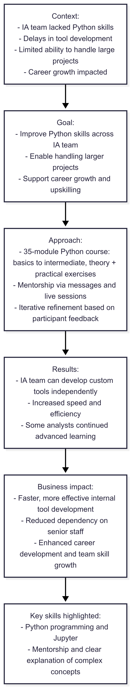
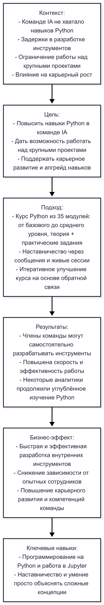

# Python Training for Intent Analysts (IA)

---

## 🇬🇧 English version

**Timeline:** Q1 2024  
**Role:** Python Developer  
**Tech stack:** Python • Jupyter  

### Context  
The IA team lacked programming skills in Python, which led to delays in developing custom tools and limited the team’s ability to take on large-scale projects. This also affected career progression, as members did not have sufficient skills for advanced positions. Improving Python skills was critical to enhance speed, analytical capabilities, and internal tool development.  

### Goal  
- Improve Python skills across the IA team.  
- Enable team members to handle larger projects and reduce dependency on senior staff.  
- Support career growth and upskilling within the team.  

### Approach  
- Designed a comprehensive Python course consisting of 35 modules, covering basics to intermediate topics, with theoretical explanations and practical exercises.  
- Mentored participants directly through messages and live sessions, providing guidance, additional explanations, and answering questions.  
- Iteratively refined course modules based on participant feedback.  

### Results  
- IA team members now have sufficient Python skills to develop custom tools independently.  
- Development speed and team efficiency increased due to new and improved tools.  
- Some analysts continued to deepen their Python knowledge beyond the course.  

### Business Impact  
- Faster and more effective internal tool development.  
- Reduced dependency on senior staff for custom solutions.  
- Enhanced career development and team skill growth.  

### Key Skills Highlighted  
- Python programming and Jupyter usage.  
- Mentorship, real-time communication, and teaching complex concepts clearly.

### Data Pipeline

---

## 🇷🇺 Русский вариант

**Таймлайн:** Q1 2024  
**Роль:** Python Developer  
**Технологии:** Python • Jupyter  

### Контекст  
Команде IA не хватало навыков программирования на Python, что приводило к задержкам в разработке кастомных инструментов и ограничивало возможность работы над крупными проектами. Это также сказывалось на карьерном росте, так как сотрудникам не хватало навыков для продвинутых позиций. Улучшение знаний Python было критично для повышения скорости, аналитических возможностей и разработки внутренних инструментов.  

### Цель  
- Повысить уровень навыков Python среди команды IA.  
- Дать возможность брать крупные проекты и снизить зависимость от опытных сотрудников.  
- Поддержать карьерное развитие и апгрейд навыков внутри команды.  

### Подход  
- Разработан комплексный курс Python из 35 модулей: от базового до среднего уровня, с теорией и практическими заданиями.  
- Курирование участников через сообщения и живые сессии: разбор вопросов, объяснение сложных моментов, дополнительная помощь.  
- Итеративное улучшение курса на основе обратной связи участников.  

### Результаты  
- Члены команды IA получили достаточные навыки Python для самостоятельной разработки кастомных инструментов.  
- Повысилась скорость и эффективность работы за счёт создания новых и улучшения существующих инструментов.  
- Некоторые аналитики продолжили углублённое изучение языка после курса.  

### Бизнес-эффект  
- Быстрая и эффективная разработка внутренних инструментов.  
- Снижение зависимости от опытных сотрудников для решения сложных задач.  
- Улучшение карьерного развития и роста компетенций команды.  

### Ключевые навыки  
- Программирование на Python и работа в Jupyter.  
- Наставничество, коммуникация и умение просто объяснять сложные концепции.

### Пайплайн

